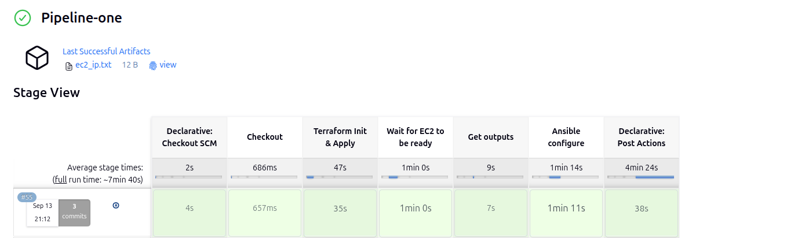
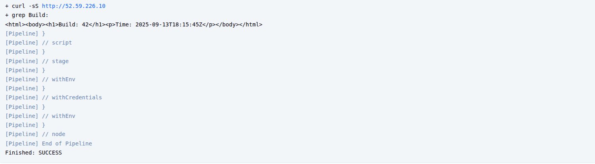
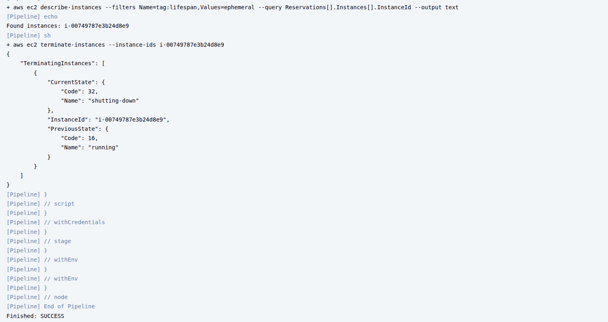

# CI/CD Ephemeral Infrastructure with Jenkins, Terraform, Ansible, and Docker

## Preparation for the CI/CD Project
Before running the pipelines, we need to set up infrastructure and tools for Jenkins.

---

### 1.1 Terraform Remote Backend Setup

I used Amazon S3 to store the Terraform state and DynamoDB for state locking to avoid race conditions when multiple pipelines run.


**Shell Script setup [`backend.sh`](infra-bootstrap/backend.sh)**
```bash
#!/bin/bash

set -euo pipefail

# ==============================
# CONFIGURATION
# ==============================
AWS_REGION="eu-central-1"
S3_BUCKET="cicd-tfstate-infra"
DDB_TABLE="tf-locks"
# ==============================


echo "Starting Terraform backend bootstrap..."
echo "Region: $AWS_REGION"
echo "S3 Bucket: $S3_BUCKET"
echo "DynamoDB Table: $DDB_TABLE"

echo "------------------------------"

# Check if S3 bucket is already exists
if aws s3api head-bucket --bucket "$S3_BUCKET" 2>/dev/null; then
    echo "S3 bucket aleady exists: $S3_BUCKET"
else
    echo "Creating S3 bucket  $S3_BUCKET..."
    aws s3api create-bucket \
      --bucket "$S3_BUCKET" \
      --create-bucket-configuration LocationConstraint="$AWS_REGION"

   echo "Enabling versioning on $S3_BUCKET..."
   aws s3api put-bucket-versioning \
     --bucket "$S3_BUCKET" \
     --versioning-configuration Status=Enabled
   echo "S3 bucket created and versioning enabled."
fi

echo "------------------------------"

# Check if DynamoDB table already exists
if aws dynamodb describe-table --table-name "$DDB_TABLE" 2>/dev/null; then
    echo "Dynamodb is already exists: $DDB_TABLE" 
else
    echo "Creating DynameDB table: $DDB_TABLE..."
    aws dynamodb create-table \
      --table-name "$DDB_TABLE" \
      --attribute-definitions AttributeName=LockID,AttributeType=S \
      --key-schema AttributeName=LockID,KeyType=HASH \
      --billing-mode PAY_PER_REQUEST \
      --region $AWS_REGION 
    # echo "Waiting for DynamoDB table to become active..."
    # aws dynamodb wait table-exists --table-name "$DDB_TABLE"
    # echo "DynamoDB table created and ready."
fi

echo "------------------------------"

echo "Backend bootstrap complete! Terraform can now use S3 + DynamoDB for state."
```

**Run:**

```bash
chmod +x backend.sh
./backend.sh
```

**Terraform Backend Block in [`backend.tf`](terraform/backend.tf)**

```bash
terraform {
  backend "s3" {
    bucket         	   = "cicd-tfstate-infra"
    key                = "cicd/terraform.tfstate"
    region         	   = "eu-central-1"
    dynamodb_table     = "tf-locks"
    encrypt        	   = true
  }
}
```

**Verification: AWS console**

1. S3 bucket 


2. DynamoDB table


---

### 1.2 Jenkins Master in Docker

I run Jenkins Master inside a container.

```bash
docker run -d \
  --name jenkins-master \
  -p 8080:8080 -p 50000:50000 \
  -v jenkins_home:/var/jenkins_home \
  -v /var/run/docker.sock:/var/run/docker.sock \
  jenkins/jenkins:lts
```

---

### 1.3 Jenkins Agent Setup (Custom Dockerfile)

I built a Jenkins agent container image that has all required tools: Terraform, Ansible, AWS CLI, Docker CLI, OpenJDK 17.

**[`Dockerfile.agent`](Dockerfile.agent)**
```bash
FROM ubuntu:22.04

ENV DEBIAN_FRONTEND=noninteractive

# Install dependencies: ssh server, docker cli, terraform, ansible, awscli
RUN apt-get update && apt-get install -y \
    openjdk-17-jdk \
    openssh-server \
    sudo \
    curl \
    unzip \
    python3 \
    python3-pip \
    docker.io \
    ansible \
    awscli \
    && rm -rf /var/lib/apt/lists/*


# Install Terraform
ARG TF_VERSION=1.6.6
RUN curl -fsSL https://releases.hashicorp.com/terraform/${TF_VERSION}/terraform_${TF_VERSION}_linux_amd64.zip -o terraform.zip && \
    unzip terraform.zip && mv terraform /usr/local/bin/ && rm terraform.zip

# Create Jenkins user
RUN useradd -m -d /home/jenkins -s /bin/bash jenkins && \
    echo "jenkins ALL=(ALL) NOPASSWD:ALL" >> /etc/sudoers && \
    mkdir -p /home/jenkins/.ssh && chmod 700 /home/jenkins/.ssh

# Copy public key into image
COPY jenkins_agent.pub /home/jenkins/.ssh/authorized_keys

RUN chmod 700 /home/jenkins/.ssh && \
    chmod 600 /home/jenkins/.ssh/authorized_keys && \
    chown -R jenkins:jenkins /home/jenkins/.ssh


# Configure SSH
RUN mkdir /var/run/sshd
EXPOSE 22

# Run SSH server
CMD ["/usr/sbin/sshd", "-D"]
```

**Build and Run Agent**

```bash
docker build -t jenkins-agent:devops -f Dockerfile.agent .  
docker run -d --name jenkins-agent \ 
  -v /var/run/docker.sock:/var/run/docker.sock \ 
  -v ~/.ssh/jenkins_agent.pub:/home/jenkins/.ssh/authorized_keys:ro \
  jenkins-agent:devops 
```
**Verification**


---

### 1.4 Jenkins Credentials Setup

- AWS Credentials
  - ID: aws-creds
  - Type: AWS Access Key & Secret

- SSH Key for EC2
  - ID: ssh-key
  - Type: SSH private key (or PEM file)
  - Username: ubuntu

- DockerHub Credentials
  - ID: dockerhub-creds
  - Type: Username & Token\
  
**Verification**


---

## 2. Pipelines

- **Pipeline 1 (Provision & Configure):** Webhook-triggered. Creates an ephemeral EC2 with Terraform (remote backend), then configures it with Ansible to install Docker.
- **Pipeline 2 (Build, Push & Deploy):** Auto-triggered after Pipeline 1. Builds an Nginx image, pushes it to private Docker Hub, then SSH-deploys to the EC2 IP.
- **Pipeline 3 (Daily Cleanup):** Scheduled. Terminates all EC2 instances tagged as ephemeral at **12:00 AM Africa/Cairo** every day.

---

### 2.1 Pipeline One: Provision Infrastructure

**Required steps:**
#### **1. Trigger:** Git webhook on push to `main`

- Configure Jenkins Job for Webhook
- Enable GitHub hook trigger for GITScm polling
  
  

- Add Webhook in GitHub repository
  
  


#### 2. Creates an ephemeral EC2 with [`Terraform`](terraform/) `Check my repo`
  - Create [`main.tf`](terraform/main.tf), [`variables.tf`](terraform/variables.tf), [`outputs.tf`](terraform/outputs.tf), [`provider.tf`](terraform/provider.tf).

#### 3. [`Ansible`](ansible/playbook.yaml): install & enable Docker on the new host `Check playbook file in my repo`.


#### 4. Create: [`Jenkinsfile.provision`](Jenkinsfile.provision)

   - Run Terraform to provision EC2

   - Extract EC2 public IP + save it

   - Run Ansible to configure EC2 (install Docker)

```bash
pipeline {
  agent { label 'agent1' }
  environment {
    TF_DIR = "terraform"
    AWS_CREDENTIALS_ID = "aws-creds"
    SSH_CREDENTIALS_ID = "ssh-key"
  }
  stages {
    stage('Checkout') {
      steps {
        checkout scm
      }
    }

    stage('Terraform Init & Apply') {
      steps {
        withCredentials([[$class: 'AmazonWebServicesCredentialsBinding', credentialsId: env.AWS_CREDENTIALS_ID]]) {
          dir("${TF_DIR}") {
            sh '''
              terraform init -input=false
              terraform apply -var-file="terraform.tfvars" -auto-approve -input=false
            '''
          }
        }
      }
    }


    stage('Wait for EC2 to be ready') {
      steps {
        echo "Waiting 60 seconds for EC2 to initialize..."
        sleep 60
      }
    }


    stage('Get outputs') {
      steps {
        withCredentials([[$class: 'AmazonWebServicesCredentialsBinding', credentialsId: env.AWS_CREDENTIALS_ID]]) {
          dir("${TF_DIR}") {
            script {
              def ip = sh(script: "terraform output -raw public_ip", returnStdout: true).trim()
              def instanceId = sh(script: "terraform output -raw instance_id", returnStdout: true).trim()

              echo "EC2 IP: ${ip}"
              echo "Instance ID: ${instanceId}"

              // Save for downstream jobs or debugging
              writeFile file: 'ec2_ip.txt', text: ip
              archiveArtifacts artifacts: 'ec2_ip.txt', fingerprint: true

              // Add info to build metadata
              currentBuild.description = "EC2_IP=${ip}"
              env.EC2_IP = ip
            }
          }
        }
      }
    }

    stage('Ansible configure') {
      steps {
          withCredentials([file(credentialsId: env.SSH_CREDENTIALS_ID, variable: 'SSH_KEY_FILE')]) {
          script {
              def ip = readFile("${TF_DIR}/ec2_ip.txt").trim()
              sh """
              # Set proper permissions for the SSH key
              chmod 600 ${SSH_KEY_FILE}
              
              # Create Ansible inventory
              echo "[ephemeral]" > /tmp/inv
              echo "${ip}" >> /tmp/inv

              # Run Ansible playbook
              ANSIBLE_HOST_KEY_CHECKING=False \\
              ansible-playbook -i /tmp/inv ansible/playbook.yaml \\
                  --private-key=${SSH_KEY_FILE} -u ubuntu
              """
          }
          }
      }
    }
}

  post {
    success {
      build job: 'Pipeline-two', parameters: [string(name: 'EC2_IP', value: env.EC2_IP)]
    }
  }
}
```
---

#### **Verification: Pipeline-one**



**1. Terraform init with remote backend (no local state).**

  


**2. Terraform apply: create t2.micro/t3.micro instance with tags:**

- Name=ci-ephemeral, lifespan=ephemeral, owner=jenkins**


**3. Terraform output: expose `public_ip`.**


**4. Ansible: install & enable Docker on the new host.**


**5. EC2 running in AWS console**


**6. Check the docker service is running in Ec2 instance**


---

### 2.2 Pipeline Two: Build & Deploy Application

**Required steps:**
#### **1. Trigger:** Automatically after Pipeline 1; receives `EC2_IP`.

- And this stage in the pipeline-one to run the pipeline-two, or **trigger it in the Pipeline-two Configuration to run after pipeline-one.**
    ```bash
    post {
        success {
        build job: 'Pipeline-two', parameters: [string(name: 'EC2_IP', value: env.EC2_IP)]
        }
    }
    ```
#### 2. Create: [`Jenkinsfile.deploy`](Jenkinsfile.deploy)
 - Build Docker image from `nginx:alpine` with custom `index.html` (show `BUILD_NUMBER` + timestamp).
 - Login to private Docker Hub using Jenkins credentials.
 - Push image tagged `docker.io/<namespace>/nginx-ci:<BUILD_NUMBER>` (or git SHA).
 - Deploy via SSH to `EC2_IP`: replace any existing container `web`, run on port 80, verify with `curl`.


```bash
pipeline {
  agent { label 'agent1' }
  parameters {
    string(name: 'EC2_IP', defaultValue: '', description: 'IP of EC2 instance')
  }
  options {
    // Prevent multiple builds running at the same time
    disableConcurrentBuilds()

  }

  environment {
    DOCKERHUB_CRED = credentials('dockerhub-creds')
    SSH_KEY_CRED = 'ssh-key'
  }

  stages {
    stage('Checkout') { steps { checkout scm } }

    stage('Prepare index.html') {
      steps {
        script {
          def ts = sh(script: "date -u +'%Y-%m-%dT%H:%M:%SZ'", returnStdout: true).trim()
          writeFile file: 'docker/nginx/index.html', text: "<html><body><h1>Build: ${env.BUILD_NUMBER}</h1><p>Time: ${ts}</p></body></html>"
        }
      }
    }

    stage('Build image') {
      steps {
        dir('docker/nginx') {
          sh "docker build -t nginx-ci:${env.BUILD_NUMBER} ."
        }
      }
    }

    stage('Login & Push') {
      steps {
        withCredentials([usernamePassword(credentialsId: 'dockerhub-creds', passwordVariable: 'DOCKER_PASS', usernameVariable: 'DOCKER_USER')]) {
          sh """
            echo "${DOCKER_PASS}" | docker login -u "${DOCKER_USER}" --password-stdin
            docker tag nginx-ci:${BUILD_NUMBER} ${DOCKER_USER}/nginx-ci:${BUILD_NUMBER}
            docker push ${DOCKER_USER}/nginx-ci:${BUILD_NUMBER}
          """
        }
      }
    }

    stage('SSH Deploy to EC2') {
     steps {
        withCredentials([
        usernamePassword(
            credentialsId: 'dockerhub-creds', 
            usernameVariable: 'DOCKER_USER', 
            passwordVariable: 'DOCKER_PASS'
        ),
        file(
            credentialsId: env.SSH_KEY_CRED, 
            variable: 'SSH_KEY_FILE'
        )
        ]) {
        lock(resource: "ec2-deploy-${params.EC2_IP}") {
            script {
            def ip = params.EC2_IP
            sh """
                # stop and remove existing container if present; run new one
                chmod 600 ${SSH_KEY_FILE}
                ssh -o StrictHostKeyChecking=no -i ${SSH_KEY_FILE} ubuntu@${ip} '
                docker pull ${DOCKER_USER}/nginx-ci:${BUILD_NUMBER} || true
                docker rm -f web || true
                docker run -d --name web -p 80:80 ${DOCKER_USER}/nginx-ci:${BUILD_NUMBER}
                '
            """
            }
         }
        }
      }
    }

    stage('Verify') {
      steps {
        script {
          def ip = params.EC2_IP
          sh "curl -sS http://${ip} | grep 'Build:' || (echo 'Verification failed' && exit 1)"
        }
      }
    }
  }
}
```

---
#### **Verification: Pipeline-two**





---

## 2.3 Pipeline Three: Cleanup Ephemeral Infrastructure

**Required steps:**

#### **1. Trigger (Jenkins schedule):**

- In the job configuration, set *Build periodically*: TZ=Africa/Cairo 0 0 * * *
  


#### 2. Create: [`Jenkinsfile.cleanup`](Jenkinsfile.cleanup)

- Use Jenkins AWS credentials (least-privilege IAM) in the job.
    ```json
    {
    "Version":"2012-10-17",
    "Statement":[{
        "Effect":"Allow",
        "Action":[
        "ec2:DescribeInstances",
        "ec2:DescribeTags",
        "ec2:TerminateInstances"
        ],
        "Resource":"*"
    }]
    }
    ```
- Find instances with the ephemeral tag (match what you set in Pipeline 1). For example:
   - lifespan=ephemeral and/or Name=ci-ephemeral
-  Terminate all matching instances (running or stopped).
-  Log the list of terminated instance IDs.

[`Jenkinsfile.cleanup`](Jenkinsfile.cleanup)

```bash
pipeline {
  agent { label 'agent1' }
  environment {
    AWS_CREDENTIALS_ID = 'aws-creds'
    AWS_DEFAULT_REGION = 'eu-central-1'
  }

  stages {
    stage('Find ephemeral instances') {

      steps {
        withCredentials([[$class: 'AmazonWebServicesCredentialsBinding', credentialsId: env.AWS_CREDENTIALS_ID]]) {
          script {
            // get instance ids with tag lifespan=ephemeral

            def ids = sh(script: """
            aws ec2 describe-instances \
              --filters "Name=tag:lifespan,Values=ephemeral" \
              --query "Reservations[].Instances[].InstanceId" --output text

              """, returnStdout: true).trim()

            if (!ids) {
              echo "No ephemeral instances found"
              currentBuild.description = "No ephemeral instances found"

            } else {

              echo "Found instances: ${ids}"
              // terminate them
              sh "aws ec2 terminate-instances --instance-ids ${ids}"
              currentBuild.description = "Terminated: ${ids}"

            }
          }
        }
      }
    }
  }
}
```
---
#### **Verification: Pipeline-three**




---